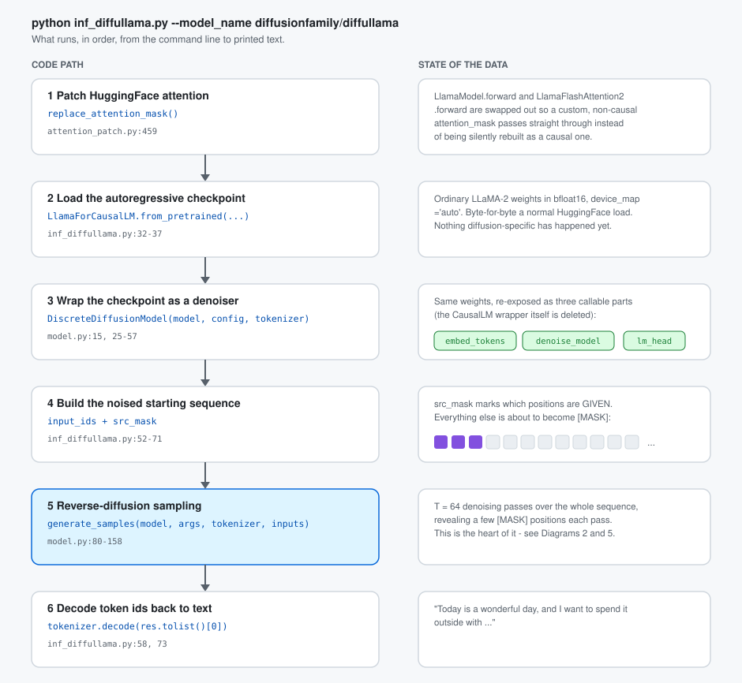
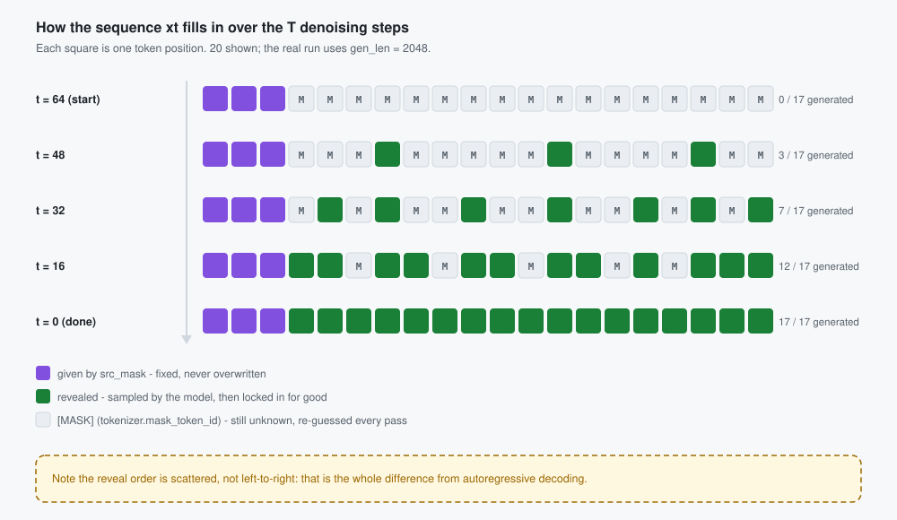
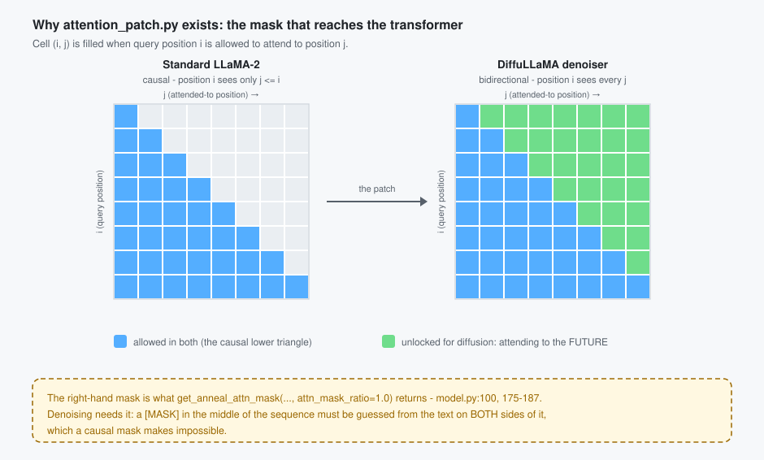
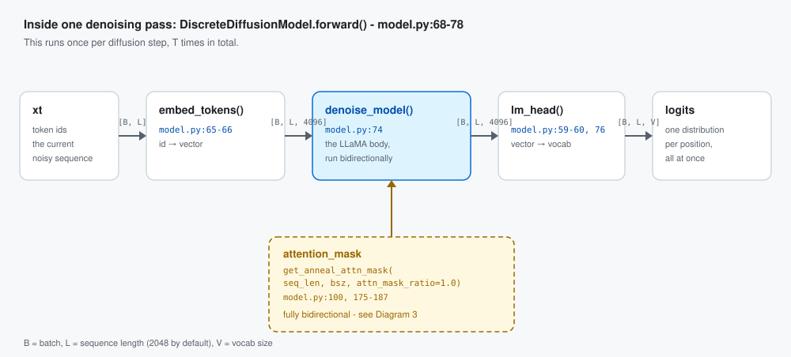
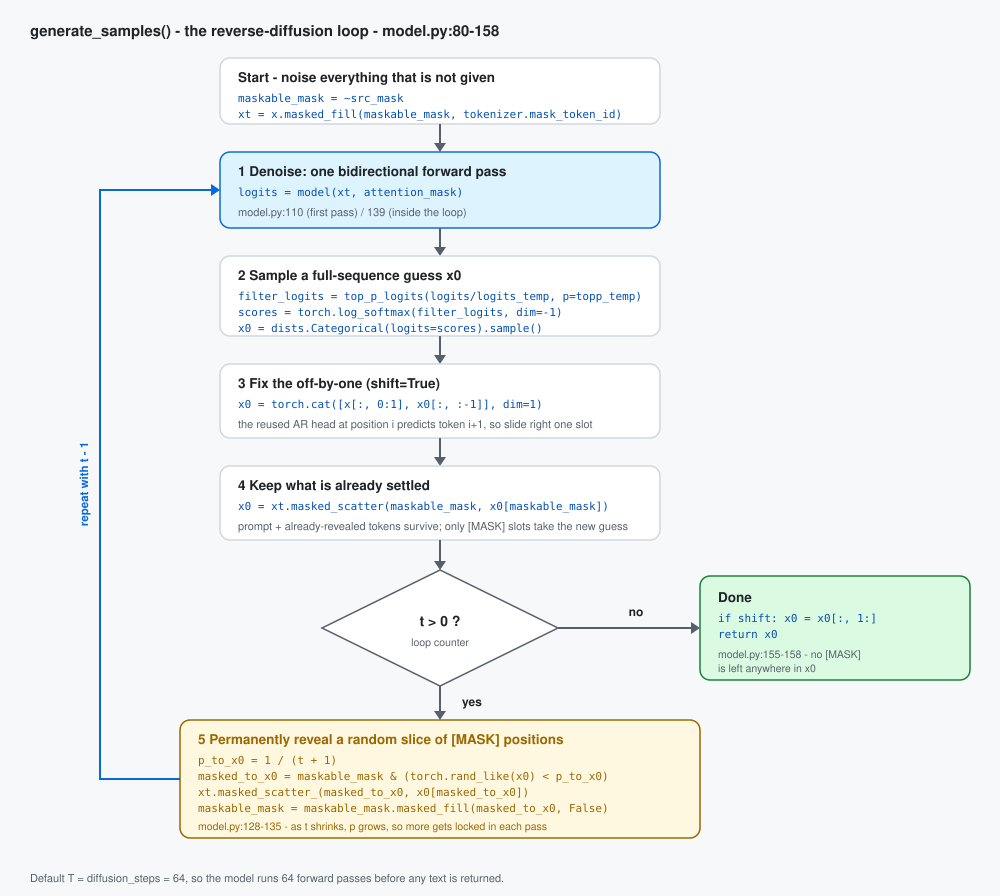

# DiffuLLaMA Inference, Explained From Zero

A companion to the main [`README.md`](README.md), written for someone who has **never
seen this repository before** and wants to understand, precisely, what happens when you
run:

```bash
python inf_diffullama.py --model_name diffusionfamily/diffullama --flash_attn flash_attention_2
```

It follows the exact call path through `inf_diffullama.py` → `model.py` →
`attention_patch.py`, names the real functions involved, and illustrates each stage with
a diagram. No prior diffusion-model or DiffuLLaMA knowledge assumed.

> This document covers **inference / sampling** only — generating text from an
> already-trained checkpoint. Training the diffusion adaptation is a separate process
> (`DiffuLLaMA-training/`, `LLaMA-Factory/src/llamafactory/train/ddm/`), touched on in
> the FAQ for orientation but not covered in depth.

---

## 1. The idea, in one paragraph

A normal large language model like LLaMA-2 is **autoregressive**: it generates text left
to right, one token at a time, and each token can only "see" the tokens before it
(*causal attention*). DiffuLLaMA takes that same pretrained LLaMA-2 and reuses it as
something different: a **discrete diffusion denoiser**. Generation starts from a
sequence that is almost entirely a special `[MASK]` token — like a blank page — and the
model is called repeatedly, dozens of times, each pass looking at the *whole* sequence at
once (bidirectionally, not causally) and filling in a few more `[MASK]` positions with
real words, until none are left. No new architecture and no new weight format: the same
LLaMA-2 layers are reused, and only *how they are called* changes.

---

## 2. File map

| File | Role |
|---|---|
| [`inf_diffullama.py`](inf_diffullama.py) | Entry point. Parses CLI args, loads the checkpoint, builds the starting (masked) input, calls the sampler, prints the decoded text. |
| [`model.py`](model.py) | Defines `DiscreteDiffusionModel` (the denoiser wrapper around LLaMA), `generate_samples()` (the reverse-diffusion sampling loop — the heart of this document), and the helpers `get_anneal_attn_mask()`, `top_p_logits()`, `LinearNoise`. |
| [`attention_patch.py`](attention_patch.py) | Monkey-patches HuggingFace's `LlamaModel.forward`, `LlamaFlashAttention2.forward` and `GPT2Model.forward` so a custom, **non-causal** `attention_mask` can be passed straight through instead of being silently overwritten with a causal one. |

---

## 3. Glossary

Read once, refer back as needed.

| Term | Meaning |
|---|---|
| AR (autoregressive) model | The original LLaMA-2 — predicts each token only from the tokens before it, one at a time. |
| Discrete diffusion | A generative process that starts from a fully "noised" (masked) sequence and iteratively denoises *all* positions in parallel until real text remains. |
| `[MASK]` / `tokenizer.mask_token_id` | The "noise". DiffuLLaMA's noise is *replace the token with a special mask id*, not Gaussian noise like image diffusion. |
| `x` | The ground-truth / given tokens: the prompt (if any) plus placeholder zeros for the part to be generated. |
| `src_mask` | `1` where a token is given (the prompt) and must never be overwritten; `0` where it must be generated. |
| `maskable_mask` | The complement of `src_mask` (`~src_mask`). Shrinks every iteration as more positions are permanently revealed. |
| `xt` | The current, partially-denoised sequence at step `t` — a mix of real tokens and `[MASK]`. |
| `x0` | The model's current best guess of the *clean* full sequence — resampled on every forward pass. |
| `diffusion_steps` (`T`) | Number of denoising passes, default `64`. More steps ≈ slower, usually better quality. |
| `logits_temp` / `topp_temp` | Sampling temperature and nucleus (top-p) cutoff applied before every token guess. |
| `shift` | An alignment fix, required because the reused LLaMA head was trained to predict "the *next* token", not "this token". Keep it `True` for these checkpoints. |
| bidirectional attention | Every position may attend to every other position, past *and* future. A normal LLaMA pass is strictly causal. |

---

## 4. Diagram 1 — The pipeline end to end

Everything `inf_diffullama.py` does, in order, before any text comes out.



---

## 5. Diagram 2 — What the sequence actually looks like over time

Before the mechanics, the intuition. `xt` is a row of token ids the same length as your
target output. A few positions are fixed (the prompt, if any); the rest start as
`[MASK]` and get replaced with real sampled tokens a little at a time, over `T` steps,
never reverting once revealed.



The scattered reveal order is the whole point: unlike autoregressive decoding, position
17 can be decided before position 4.

---

## 6. Diagram 3 — Why `attention_patch.py` has to exist

A `[MASK]` sitting in the middle of the sequence has to be guessed from the text on
**both** sides of it. A causal mask makes that impossible, so the mask that reaches the
transformer must be changed — which is exactly what the monkey-patch enables.



---

## 7. Diagram 4 — Inside a single denoising pass

Each of the `T` passes runs exactly this: `DiscreteDiffusionModel.forward()`
(`model.py:68-78`). Note that it is a plain forward pass with no KV cache and no
incremental decoding — the entire sequence is recomputed every time.



---

## 8. Diagram 5 — The reverse-diffusion loop

This is `generate_samples()` in full (`model.py:80-158`): the algorithm that turns a
fully-masked sequence into finished text.



The one genuinely non-obvious step is box 5. Rather than revealing tokens in order, each
iteration flips a coin with probability `p = 1/(t+1)` for every still-masked position and
locks in the winners. Early on `t` is large so `p` is small and few tokens commit; as `t`
falls toward 1, `p` rises toward 1 and the remaining positions all resolve.

---

## 9. Flags that change this behavior

`inf_diffullama.py:17-24`:

| Flag | Default | Effect |
|---|---|---|
| `--diffusion_steps` | `64` | `T` in Diagram 5 — how many denoising passes run. |
| `--logits_temp` | `0.9` | Temperature dividing the logits before filtering and sampling. |
| `--topp_temp` | `0.9` | Nucleus (top-p) cutoff used by `top_p_logits()`. |
| `--shift` | `True` | Leave on for these checkpoints — see the FAQ. |
| `--flash_attn` | `eager` | `eager`, `sdpa`, or `flash_attention_2` — which attention kernel backs `denoise_model`. |
| `--verbose` | `False` | Prints the partially-decoded `xt` at every step, so you can literally watch Diagram 2 happen in your terminal. |

---

## 10. FAQ

**Why call the model `T` times instead of once?**
Because this is diffusion, not autoregression: the model never commits to an output in a
single pass. Each of the `T` calls sees the whole sequence as it currently stands and
refines the guess everywhere at once — which is what makes bidirectional attention
(Diagram 3) necessary in the first place.

**Why the "shift"?**
`DiscreteDiffusionModel` reuses the *unmodified* LLaMA `lm_head`, which was trained as a
next-token predictor: logits at position `i` predict the token at `i+1`, not at `i`.
`generate_samples()` corrects for this by sliding the sampled guesses one slot right
(`model.py:118-121`) before using them. This is a consequence of reusing an AR
checkpoint's head as-is, not something diffusion models need in general.

**Is `LinearNoise` (`model.py:160-173`) used in this flow?**
No. It describes the abstract absorbing-state noise schedule (α_t) used conceptually and
during training. The inference loop never calls it — it hardcodes its own reveal
schedule directly as `p_to_x0 = 1/(t+1)` (`model.py:131`).

**What is `get_anneal_attn_mask` really building?**
A causal mask blended with a random mask, controlled by `attn_mask_ratio`
(`model.py:175-187`). During adaptation training that ratio is annealed from `0.0`
(causal, like the original AR model) toward `1.0` (fully bidirectional), which is how the
model is gently taught to use future context. At inference it is always called with
`attn_mask_ratio=1.0` (`model.py:100`) — the fully-bidirectional right-hand grid in
Diagram 3 — matching the fully-adapted checkpoint.

**Why is generation slow compared to a normal LLM?**
There is no KV cache. Every one of the `T` passes recomputes the full sequence from
scratch (Diagram 4), so the cost is roughly `T` full forward passes over `gen_len`
tokens. Lowering `--diffusion_steps` is the main speed lever.

**Does training follow this same loop?**
No. Training optimizes the denoiser's weights against a diffusion objective over the
adaptation corpus; this document only covers using an already-trained checkpoint. Training
code lives in `DiffuLLaMA-training/` (custom LLaMA-2 adaptation) and
`LLaMA-Factory/src/llamafactory/train/ddm/` (the `ddm` / `ddm-sft` stages described in the
main [`README.md`](README.md)).

---

*Supplement to [`README.md`](README.md); it does not replace it — see the main README for
installation, training, finetuning and evaluation. Diagram sources live in
[`assets/simplified/`](assets/simplified/).*
