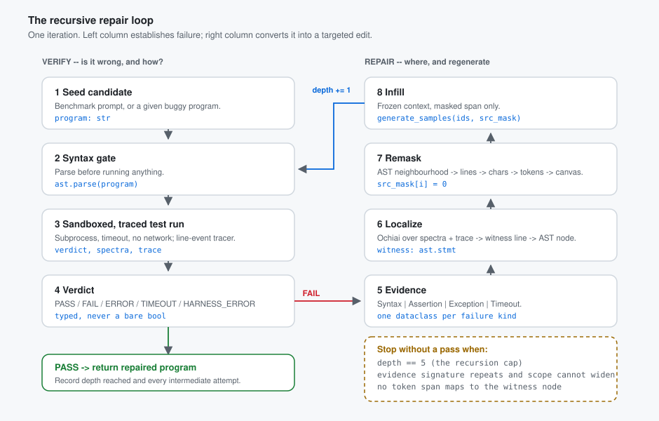
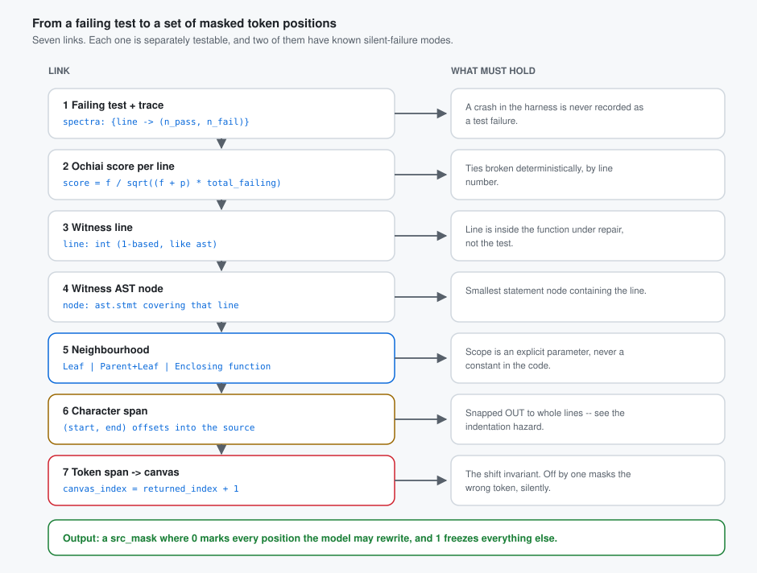

# EGR — Execution-Grounded Remasking

**A plan, not an implementation.** Nothing in `egr/` runs yet. This directory contains the full design
for a proof-of-concept module, written so that implementation can start immediately and produce a first
experimental result within days rather than weeks.

| Document | What it answers |
|---|---|
| **`README.md`** (this file) | What we are building, why, and the plan end to end |
| [`docs/01-architecture.md`](docs/01-architecture.md) | Module layout, the five protocols, data structures, the intended CLI |
| [`docs/02-experiment-plan.md`](docs/02-experiment-plan.md) | Benchmarks, baselines, metrics, ablations, compute budget |
| [`docs/03-hazards.md`](docs/03-hazards.md) | The silent-failure register and the invariant tests that must exist *before* the selector |
| [`docs/04-build-phases.md`](docs/04-build-phases.md) | Step-by-step build order with an acceptance test per phase |

---

## 1. The idea in one paragraph

Diffusion language models denoise a whole sequence at once, and any subset of positions can be frozen.
That makes a **targeted edit** a first-class operation: you can re-generate five tokens in the middle of a
program while every other token stays byte-identical. Autoregressive models cannot do this — they must
re-emit the suffix, and in practice they perturb code they were not asked to touch. We take that property
and build a code-generation loop around it. When a candidate program fails its tests, we do not resample
the program. We run it, watch which lines executed, work out **which statement is implicated**, mask only
the tokens belonging to that statement's syntactic neighbourhood, and let the diffusion model re-fill just
that hole with the rest of the program frozen as context. If it still fails, we repeat, widening the
neighbourhood, up to a recursion depth of 5.

The claim under test: **failure evidence from actually running the program is a better anchor for choosing
what to remask than either model confidence or static analysis.**



---

## 2. Why this idea fits *this* anchor paper

This is not a generic agentic-repair project that happens to use a diffusion model. It targets the one
thing our anchor paper measured and advertised.

DiffuLLaMA's own paper reports **no whole-function HumanEval pass@1 for the released checkpoint.** The
only code result in the paper is **HumanEval single-line *infilling***, and even that number (0.76) belongs
to a separately trained `Diffu-CodeLLaMA`, not to `diffusionfamily/diffullama`. The paper's argument about
code is explicitly an *infilling* argument:

> "DLMs are naturally suited for this task, as they are trained to handle masked inputs, which is a key
> advantage."
> — *Scaling Diffusion Language Models via Adaptation from Autoregressive Models*, Appendix C.3

So the model is documented as **good at filling a hole in existing code** and undocumented (with the
adjacent GPT2-M "Code" column sitting at 2.6) at **writing a whole function from a docstring**. A design
that asks it to write whole functions is fighting the checkpoint. A design whose central operation is
"here is a program with a hole in it, fill the hole" is playing to the one capability the authors
measured.

That is exactly what EGR's inner loop is. **The repair step is an infilling query.** This is the reason to
believe the POC can produce a real result on the hardware and checkpoints the team actually has.

> This shapes the experiment plan more than any other single fact — see
> [`docs/02-experiment-plan.md` §2](docs/02-experiment-plan.md), where it splits the work into a
> low-risk **repair track** and a higher-risk **generation track**.

---

## 3. Relation to prior work — stated plainly

**CDC** ([arXiv:2605.16829](https://arxiv.org/abs/2605.16829), *Constrained Code Generation with Discrete
Diffusion*) already does structure-guided remasking. Its MDFI operator builds a partial code property
graph mid-denoising, finds an offending node, takes its AST/dataflow neighbourhood, lifts that to token
spans, and remasks under a budget. The project has verified this by reading the paper in full, and three
novelty claims were deleted as a result (`project-docs/03-established-facts.md` F-8, F-12).

**We are a follow-up to CDC and will be written as one.** The honest framing:

> CDC established that a *static* witness node can anchor structural remasking. We ask whether a *dynamic*
> witness — the statement implicated by an actually-failing test — anchors it better, and we run the
> matched-budget policy comparison CDC does not.

What is genuinely still open, all verified in `project-docs/03-established-facts.md` F-13:

| Gap | Status |
|---|---|
| Execution feedback as the remasking anchor — traceback, spectra, failing-test localization | **CDC is purely static.** Nothing in the literature does this. |
| An iterate-until-pass repair loop over a diffusion LM | CDC is constrained *generation*; it has no loop. |
| Numbers on a **repair** benchmark for this model family | CDC reports none — no HumanEvalFix, DebugBench, QuixBugs, Defects4J. |
| A **confidence-based remasking baseline** at matched budget | Exists nowhere, at any budget. We run it. |
| Does CDC's neighbourhood-scope optimum transfer to *functional* bugs? | CDC's Fig. 8(b) optimum is on **CWEval, a security benchmark**. Unmeasured for functional bugs — this is open question Q-8, and our scope ladder answers it directly. |

We claim none of CDC's ground. We claim the dynamic anchor, the loop, and the two missing baselines.

---

## 4. What the model actually receives

The user-facing description of this project is "give the diffusion model back the annotated AST with a
trace of execution, and it works out what caused the failure." That has to be translated into something a
**base, non-instruction-tuned 6.7B diffusion LM** can act on. DiffuLLaMA cannot be asked to "identify the
buggy line" — it is a completion model, not an agent. So the design splits the feedback into two channels
and is explicit about which one is load-bearing.

**Channel 1 — structural (load-bearing).** The harness does the localization. Evidence → witness AST node
→ neighbourhood → token span → `src_mask = 0` on those positions. The model never "decides" where the bug
is; it is *conditioned* on a canvas where only the implicated region is a hole. This is mechanical,
testable, and does not depend on the model understanding anything.

**Channel 2 — annotated context (an ablation, not an assumption).** The failure is also rendered as a
frozen comment block placed in the canvas above the function, so the bidirectional attention can see it:

```python
# FAILED: sum_list([1, 2, 3]) -> 5, expected 6
# line 4:  total += n          executed 2x, expected 3x
# ochiai:  line 4 = 1.00, line 3 = 0.58, line 5 = 0.00
def sum_list(nums):
    ...
```

Whether a base LM exploits a natural-language failure description is an **open empirical question**, so it
ships as a flag (`--annotate {none,comment,compact}`) and is reported as an ablation. We will not assume it
helps. If it does not, Channel 1 alone is still the contribution.

---

## 5. The plan, step by step

Each step has an owner-independent acceptance criterion. Full detail with per-file acceptance tests is in
[`docs/04-build-phases.md`](docs/04-build-phases.md).

### Step 0 — Freeze the hazard register *before* writing the selector
Write the invariant tests first: the shift off-by-one, the indentation policy, the outcome taxonomy, the
encoding rules. The project has already been bitten three times by off-by-N index bugs
(`project-docs/05-mistakes-and-bugs.md` §B), and the shift bug is *silent* — it runs end to end and just
underperforms. **Acceptance:** `pytest egr/tests/test_invariants.py` passes, and it fails loudly if the
`+1` is removed.

### Step 1 — Build everything except the model (no GPU required)
Canvas, verifier + sandbox, tracer, evidence types, localizer, policies, loop, reporting — plus a
`MockBackend` that satisfies the `DiffusionBackend` protocol on CPU with deterministic behaviour. The
entire pipeline runs end to end on a laptop before a single GPU hour is spent.
**Acceptance:** the loop closes on a mutation-injected bug using `MockBackend` and writes a well-formed
JSONL run record.

> This matters organisationally: only three of seven team members have workstation access
> (`project-docs/01-project-brief.md`). Step 1 is work the other four can do in full.

### Step 2 — Measure localization accuracy, with no model at all
Inject single-statement mutations into HumanEval+ canonical solutions. Ground-truth fault location is then
*known exactly*. Score each localization policy — ours, static-only, confidence, random — on top-1 and
top-3 statement accuracy.
**This is a real, reportable result that costs zero GPU hours** and it de-risks everything downstream: if
execution-grounded localization does not beat the alternatives at *finding* the bug, the repair numbers
were never going to work either, and we learn that in week one instead of week six.
**Acceptance:** a localization-accuracy table across ≥4 policies on ≥200 mutants.

### Step 3 — Wire the real backend and smoke-test
Implement `DiffuLLaMABackend` over the existing `generate_samples`, with the additive sampler change needed
to return max-softmax confidence (the existing `x0_scores` is the *sampled-token* log-prob and is never
returned — using it would make the confidence baseline unfairly weak and bias results in our favour;
`project-docs/05-mistakes-and-bugs.md` M-10). Run 10 problems.
**Acceptance:** at least one problem that fails at depth 0 passes at depth ≤ 5, with the diff confined to
the masked span.

### Step 4 — The headline run: the repair curve
pass@1 as a function of recursion depth, 0 → 5, for every policy, at matched budget.
**Acceptance:** the repair-curve figure, on HumanEvalFix-Python and mutation-injected HumanEval+.

### Step 5 — The generation track
Seed the candidate from the DLM itself rather than from a given buggy program. This is the "code
generation via targeted repair" framing in full. Expected to be weak on DiffuLLaMA for the reasons in §2 —
so it also runs on **Dream-Coder-v0-Instruct-7B**, which is a one-class change behind the backend
protocol, to show the mechanism is not checkpoint-specific.
**Acceptance:** the same repair curve for both backbones, with the DiffuLLaMA result reported honestly
whatever it is.

### Step 6 — Ablations and write-up
Scope ladder (Leaf / Parent+Leaf / Enclosing function — this answers Q-8), annotation channel on/off,
budget sweep, steps-to-convergence.

---

## 6. Benchmarks

Chosen to satisfy "popular, cited by everyone, with **both** syntax checks and functional tests."

| Benchmark | Role | Why |
|---|---|---|
| **HumanEval+ / MBPP+** (EvalPlus) | Primary functional benchmark | The most-cited code-generation benchmarks, with EvalPlus's much stronger test suites. 164 + 378 problems. |
| **HumanEvalFix** (Python, from OctoPack) | Primary *repair* benchmark | Gives a known buggy program and a failing test — isolates repair skill from generation skill. Fills the gap that CDC reports no repair numbers at all. |
| **Mutation-injected HumanEval+** | Localization ground truth | We inject the bug, so we know exactly where it is. The only way to score localization directly. Unlimited, free, no GPU. |

**Syntax checking is not a formality here.** A base diffusion LM emitting raw text produces malformed
Python often, so `ast.parse` is a first-class, frequently-firing gate — and a `SyntaxError` carries
`lineno`/`offset`, which is itself a precise localization signal. Syntax failures and functional failures
enter the loop through the same `Evidence` interface.

⚠️ EvalPlus stores test **inputs** evaluated differentially against `canonical_solution`, not literal
assert strings; the harness must render them into asserts itself (`project-docs/03-established-facts.md`
F-16). Also, the correct problem counts are **542 total (164 + 378)**, not the ~560 figure that predates
EvalPlus v0.2.0.

---

## 7. What gets measured

| Metric | Why it is here |
|---|---|
| **pass@1 at depth *k***, k = 0…5 | The headline. The shape of the curve *is* the result. |
| **Δ pass@1 from depth 0** | Isolates what the loop contributes over the seed. |
| **Localization top-1 / top-3** | Measurable with no GPU; separates "found the bug" from "fixed the bug". |
| **Edit locality** — tokens changed / tokens in the program | Tests the premise in §1. If our edits are not more local than a resample's, the whole motivation is wrong, and we should find that out. |
| **Regression rate** — repairs that fix one test and break another | A monotone-looking loop can still be degrading. |
| **Steps-to-convergence** | The only place an efficiency claim could live — see the warning below. |
| **Outcome taxonomy counts** | PASS / FAIL / ERROR / TIMEOUT / **HARNESS_ERROR**, always separated. |

> ⛔ **We will never claim a speed win from targeted remasking.** `model.py:139` forwards the entire
> sequence every denoising step regardless of how many positions are masked — repairing 5 tokens costs
> exactly what regenerating 500 costs at equal step count. The only available win is **quality**
> (`project-docs/06-findings-and-wins.md` W-5). The one unclaimed opening is that targeted repair might
> *converge in fewer steps*, which nobody has measured; that is why steps-to-convergence is in the table.

---

## 8. Baselines — deliberately harsh

Each comparison is designed to isolate exactly one thing. All run at **matched budget**: the same number of
`generate_samples` calls.

| # | Baseline | What `ours` vs. it isolates |
|---|---|---|
| B0 | Single-shot generation, no repair | Does the loop do anything at all |
| B1 | **Best-of-N full resampling**, N = depth cap + 1 | Repair vs. just trying again — the harshest baseline, and fair because targeted remasking saves no compute |
| B2 | Random-span remask, matched token budget | Informed localization vs. an uninformed hole in the same place-count |
| B3 | **Confidence remask** (max softmax, not `x0_scores`) | Structure vs. model self-assessment — *this comparison exists nowhere in the literature* |
| B4 | Static-only structural remask (CDC-like, no execution) | **The dynamic anchor itself** — this is the paper's core claim |
| **Ours** | Execution-grounded structural remask | — |

B1 and B4 are the two that can kill the idea, which is why they are in from the start rather than added
after the fact.

---

## 9. Intended interface (contract, not yet built)

```bash
# localization only -- no GPU, no model weights
python -m egr.cli localize --benchmark mutants --n 200 --policies ours,static,confidence,random

# the full loop against a real checkpoint
python -m egr.cli run \
    --benchmark humanevalfix \
    --backend diffullama \
    --policy ours \
    --scope parent_leaf \
    --annotate comment \
    --max-depth 5 \
    --seed 0 \
    --out runs/hef_ours_d5_s0.jsonl

# same loop, no GPU, deterministic -- for CI and for laptop development
python -m egr.cli run --benchmark mutants --backend mock --policy ours --max-depth 5
```

One JSONL record per attempt, one file per run configuration. Every experiment in
[`docs/02-experiment-plan.md`](docs/02-experiment-plan.md) is a sweep over these flags — no bespoke scripts.

---

## 10. The three risks that could sink this

Stated up front rather than discovered in week five. Full register in
[`docs/03-hazards.md`](docs/03-hazards.md).

1. **The backbone may be too weak to show a curve.** DiffuLLaMA has no reported whole-function code
   ability (§2). *Mitigation:* the repair track starts from a given buggy program, which plays to
   documented infilling strength; and the backend protocol makes Dream-Coder a one-class addition.
2. **The loop can stall deterministically.** At low temperature, remasking the same span in the same
   context reproduces the same tokens — the loop then burns all 5 depths producing one identical "fix."
   Dream in particular ships `temperature: 0.0` and `alg: "origin"` (random order), a documented
   silent-failure mode (F-10). *Mitigation:* every iteration must change something — scope escalation,
   annotation, or seed — and a no-progress detector is a stop condition, not an afterthought.
3. **The shift off-by-one and the indentation bleed are both silent.** `canvas_position = returned_index + 1`
   (F-3), and 85% of statement nodes bleed a leading indentation character because SentencePiece glues the
   last indent space onto the following identifier (F-21). *Mitigation:* one shift-aware mapping function
   in `canvas.py`, invariant-tested; and an explicit **snap-to-whole-lines** masking policy, chosen and
   documented rather than arrived at silently.



---

## 11. Status and relation to the project's open direction decision

`project-docs/02-decision-log.md` records **P-1** as pending: Option B (adaptation audit) vs Option C
(structure-guided remasking) vs Option E. **EGR is a sharpened Option C** — specifically the
"execution-grounded seeding" reframing that `project-docs/07-decision-tree.md` already identified as
*verified genuinely open* after CDC removed the original mechanism claim.

This branch does not settle P-1. It makes Option C concrete enough to be chosen or rejected on evidence,
and it front-loads the parts (Steps 0–2) that are cheap, GPU-free, and informative regardless.
