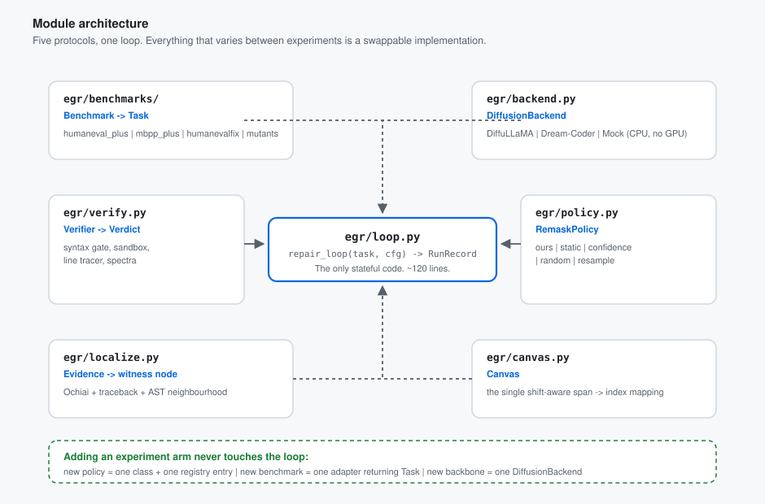

# Architecture

How `egr/` is put together, and why it is put together that way. Read
[`../README.md`](../README.md) first for the idea; this document is the design.

---

## 1. Design principles

Five rules, each of which is a direct response to something the project has already been bitten by or
already established.

**P1 — One loop, five protocols.** All the variation between experiments (which benchmark, which model,
which remasking policy, which neighbourhood scope) lives behind an interface. `loop.py` never changes when
an experiment arm is added. This is what makes the ablation grid in
[`02-experiment-plan.md`](02-experiment-plan.md) a config sweep rather than six forked scripts.

**P2 — The model is the last thing we need.** A `MockBackend` satisfies the same protocol as DiffuLLaMA on
CPU, deterministically. Every module except one is developed and tested without a GPU. Four of seven team
members have no workstation access, and the shared GPUs are contended
(`project-docs/01-project-brief.md`), so *not* being blocked on hardware is an architectural requirement,
not a convenience.

**P3 — Index arithmetic happens in exactly one place.** The shift invariant
`canvas_position = returned_index + 1` is proven and exact (`project-docs/03-established-facts.md` F-3),
and the project has produced off-by-N index bugs three separate times
(`project-docs/05-mistakes-and-bugs.md` §B). Therefore no module except `canvas.py` is permitted to do
arithmetic on token indices. Everything else passes around `Span` objects.

**P4 — Every outcome is typed, and infrastructure failure is never a result.** A sandbox timeout, an
import error in the harness, and an assertion failure are three different things. Conflating them once
already nearly produced a reported hallucination rate of 1.0 from an HTTP 429
(`project-docs/05-mistakes-and-bugs.md` M-19). `Verdict` is an enum with a `HARNESS_ERROR` member and it
is counted separately in every table.

**P5 — Additive, never destructive.** `model.py` and `generate_samples` are used as they are. Where we
need something they do not provide (per-position max-softmax confidence), we add a new function beside the
old one rather than editing it, so the anchor paper's reproduction path stays byte-identical.

---

## 2. Module map



```
egr/
├── README.md
├── docs/                        # this design set
├── types.py                     #  ~90 LOC  every dataclass and enum, no logic
├── canvas.py                    # ~140 LOC  THE index authority: text <-> tokens <-> canvas
├── verify.py                    # ~200 LOC  syntax gate + sandboxed traced execution -> Verdict
├── trace.py                     # ~110 LOC  line-event tracer, coverage spectra, failure frame
├── evidence.py                  #  ~90 LOC  Verdict + trace -> a typed Evidence value
├── localize.py                  # ~170 LOC  Evidence -> witness node -> neighbourhood -> Span set
├── policy.py                    # ~180 LOC  the six remasking policies, one registry
├── backend.py                   # ~160 LOC  DiffusionBackend protocol + DiffuLLaMA + Mock
├── loop.py                      # ~120 LOC  the recursion. The only stateful code.
├── report.py                    #  ~80 LOC  JSONL writer + schema version
├── cli.py                       # ~120 LOC  argparse -> Config -> loop -> report
├── benchmarks/
│   ├── base.py                  #  ~40 LOC  Task record + Benchmark protocol
│   ├── humaneval_plus.py        #  ~90 LOC  incl. rendering EvalPlus inputs into asserts
│   ├── mbpp_plus.py             #  ~60 LOC
│   ├── humanevalfix.py          #  ~70 LOC
│   └── mutants.py               # ~120 LOC  mutation injection with known ground truth
└── tests/
    ├── test_invariants.py       # written FIRST -- see 03-hazards.md
    ├── test_canvas.py
    ├── test_localize.py
    ├── test_verify.py
    └── test_loop_mock.py
```

**~1,900 lines including tests.** That is the target, and it is a design constraint: if a module is
drifting well past its budget, the abstraction is wrong.

---

## 3. Core types

All in `types.py`, all frozen dataclasses. No logic lives here — this is the vocabulary the other modules
speak.

```python
class Verdict(StrEnum):
    PASS          = "pass"           # every test passed
    FAIL          = "fail"           # a test assertion failed
    ERROR         = "error"          # the program raised
    SYNTAX_ERROR  = "syntax_error"   # ast.parse rejected it
    TIMEOUT       = "timeout"        # exceeded the wall clock
    HARNESS_ERROR = "harness_error"  # OUR bug, never counted as a model result

@dataclass(frozen=True)
class Task:
    task_id: str                 # "HumanEval/0"
    prompt: str                  # signature + docstring
    seed_program: str            # what depth 0 starts from
    tests: str                   # rendered, runnable asserts
    entry_point: str             # function under repair
    ground_truth_line: int | None = None   # mutants only; scores localization

@dataclass(frozen=True)
class Span:
    """A half-open interval. The unit carried between modules -- never a bare int."""
    start: int
    end: int
    kind: Literal["char", "token", "canvas"]

@dataclass(frozen=True)
class TestOutcome:
    name: str
    passed: bool
    exc_type: str | None
    message: str | None
    frames: tuple[tuple[str, int], ...]   # (filename, lineno), innermost last

@dataclass(frozen=True)
class Observation:
    """Everything one execution of the candidate told us."""
    verdict: Verdict
    outcomes: tuple[TestOutcome, ...]
    spectra: Mapping[int, tuple[int, int]]   # line -> (n_passing_tests, n_failing_tests)
    exec_counts: Mapping[int, int]           # line -> times executed, failing tests only
    syntax_error: tuple[int, int, str] | None   # (lineno, offset, msg)
    stdout_tail: str
    duration_s: float

@dataclass(frozen=True)
class Evidence:
    """The normalised failure description. One kind, whatever the verdict was."""
    kind: Literal["syntax", "assertion", "exception", "timeout"]
    lines: tuple[int, ...]        # candidate fault lines, best first
    scores: Mapping[int, float]   # line -> suspiciousness, for the annotation channel
    summary: str                  # one line of human-readable text
    signature: str                # stable hash -- drives no-progress detection

@dataclass(frozen=True)
class RemaskPlan:
    canvas_spans: tuple[Span, ...]   # kind == "canvas", already shift-corrected
    n_masked: int                    # the budget actually spent
    scope: str                       # "leaf" | "parent_leaf" | "function"
    rationale: str                   # why these spans -- goes into the run record

@dataclass(frozen=True)
class Attempt:
    depth: int
    program: str
    observation: Observation
    evidence: Evidence | None
    plan: RemaskPlan | None
    tokens_changed: int | None       # edit locality, vs. the previous depth
    wall_s: float
```

---

## 4. The five protocols

```python
class Benchmark(Protocol):
    name: str
    def tasks(self, limit: int | None = None) -> Iterator[Task]: ...

class DiffusionBackend(Protocol):
    name: str
    def tokenize(self, text: str) -> tuple[list[int], list[Span]]: ...   # ids + char spans
    def detokenize(self, ids: Sequence[int]) -> str: ...
    def infill(self, canvas_ids: Sequence[int], src_mask: Sequence[int],
               *, steps: int, temperature: float, seed: int) -> list[int]: ...
    def confidence(self, canvas_ids: Sequence[int]) -> list[float]: ...  # max softmax, per position

class RemaskPolicy(Protocol):
    name: str
    def plan(self, program: str, ev: Evidence, canvas: "Canvas",
             *, budget: int, scope: str, rng: random.Random) -> RemaskPlan | None: ...

class Localizer(Protocol):
    def witness(self, program: str, ev: Evidence) -> ast.stmt | None: ...

class Verifier(Protocol):
    def check(self, program: str, task: Task) -> Observation: ...
```

`plan()` returning `None` is a first-class outcome meaning "no maskable region could be derived" — the loop
stops on it rather than silently masking nothing and reporting a failure to repair.

---

## 5. `canvas.py` — the index authority

Everything that could produce a silent off-by-one is confined here, behind three functions and one
invariant test file.

### 5.1 Canvas construction

The canvas is `[BOS] + tokens(program)`. This is not arbitrary — it falls out of the sampler's shift:

```
model.py:120   x0 = cat([x[:, 0:1], x0[:, :-1]])    # position 0 preserved, everything shifts right
model.py:156   x0 = x0[:, 1:]                        # position 0 dropped on the way out
```

so an input of length `1 + n` returns exactly `n` tokens, and:

```
returned[k]  ==  canvas[k + 1]
```

This is `project-docs/03-established-facts.md` F-3, proven exactly and tokenizer-independently by
`audit/test_shift_offset.py` (which currently lives only on the `audit/opus-review` branch — Phase 0
rescues it). Putting BOS at canvas position 0 means **the returned sequence is exactly the
program's tokens**, with no trimming logic anywhere else.

```python
class Canvas:
    program: str
    ids: list[int]                 # [BOS] + program tokens
    char_spans: list[Span]         # per program token; index i <-> canvas position i + 1

    def canvas_positions(self, char_span: Span) -> Span:
        """char span -> canvas positions. The ONLY place `+ 1` appears in the codebase."""

    def src_mask(self, holes: Sequence[Span]) -> list[int]:
        """1 = frozen, 0 = the model may write here. Position 0 (BOS) is always 1."""
```

`grep -rn '+ 1' egr/` should have exactly one interesting hit. That is a reviewable property, and
`test_invariants.py` asserts it.

### 5.2 The indentation policy — chosen, not stumbled into

Against the real `diffusionfamily/diffullama` tokenizer, 26 of 26 statement nodes mapped to tokens that
fully cover their source, but **22 of 26 (85%) bleed one leading indentation character**, because
SentencePiece glues the final space of an indent onto the following identifier: a 4-space indent tokenizes
as `▁▁▁` + `▁disc`. The bled text was whitespace in all 22 cases and code in none
(`project-docs/03-established-facts.md` F-21).

Three policies were available. **We choose (a), snap-to-whole-lines**, and say so:

| | Policy | Verdict |
|---|---|---|
| **(a)** | **Snap every mask span outward to whole lines, indentation included** | **CHOSEN** |
| (b) | Exclude the leading-whitespace token, freeze the statement's first sub-token | Rejected — freezes part of the thing we are trying to repair |
| (c) | Strip indent, tokenize, re-attach | Rejected — a second offset mapping, i.e. a second chance at an off-by-N |

Reasons: Python indentation is semantic, so a partial-line mask asks the model to reproduce an exact indent
it can only half see; whole-line spans make the char→token mapping trivially checkable; and **the naive
"mask every token overlapping the AST span" rule already silently does (a)** — F-21 says so explicitly. We
would rather do it deliberately and document it than do it by accident.

Consequence to state in the write-up: our masking granularity is the **line**, not the token. That is a
limitation and it is also what makes the edit-locality metric meaningful.

### 5.3 The fixed-length constraint — the non-obvious one

Masked diffusion infills **exactly as many tokens as it masks.** A hole of 12 token positions yields 12
tokens. If the correct repair needs 15, it cannot be expressed, and the loop will fail for a reason that
has nothing to do with localization.

This is easy to miss and would quietly cap the ceiling of every result. Two mechanisms handle it:

1. **Hole slack.** The hole is `n_span_tokens + slack`, with `slack` a config parameter swept in the
   ablations. Extra positions can be absorbed as whitespace or a longer expression.
2. **Rebuild between depths.** The canvas is rebuilt from the *current program text* at every iteration, so
   program length is free to change across depths. The constraint binds only *within* a single `infill`
   call.

Neither is a workaround to hide — the slack sweep is a reported ablation, because "how much room does a
targeted repair need?" is a genuinely interesting question about the method.

---

## 6. `verify.py` and `trace.py` — evidence, not just a boolean


### 6.1 Gate order

1. **`ast.parse(program)`** — if this raises, we have a `SYNTAX_ERROR` and a precise `(lineno, offset)`.
   Nothing is executed. This gate fires often with a base diffusion LM, and its output is a *better*
   localization signal than anything the dynamic path produces.
2. **`compile()`** — catches a small class of things the parser accepts.
3. **Sandboxed execution** of each test, individually, under a tracer.

### 6.2 Sandbox

Non-negotiable: this executes model-generated code. A fresh `subprocess` per candidate, with
`resource.setrlimit` on CPU time, address space and file size; a hard wall-clock timeout with
`kill -9` on expiry; `cwd` in a temporary directory; environment stripped; no network. Results come back
over a pipe as JSON. **`PYTHONIOENCODING=utf-8` and `encoding="utf-8"` on every open** — the project has
hit cp1252 crashes three times, once specifically while printing a SentencePiece `▁`
(`project-docs/05-mistakes-and-bugs.md` M-11).

### 6.3 Tracing

`sys.settrace` (or `sys.monitoring` on 3.12+) with a line-event callback, active only while the candidate's
own file is executing. Per test we record executed lines and per-line execution counts; on an exception we
record the frame stack. This gives, for free:

- **coverage spectra** — `line -> (n_passing_tests, n_failing_tests)`, which is what Ochiai needs;
- **execution counts** — "line 4 ran 2×" is exactly the kind of annotation a loop-bound bug reveals;
- **the failure frame** — the innermost line inside the function under repair.

Stdlib only. No AST instrumentation, no coverage.py dependency, and nothing that changes the semantics of
the program being tested.

---

## 7. `localize.py` — from evidence to a witness node

### 7.1 Per evidence kind

| Kind | Primary signal |
|---|---|
| `syntax` | `SyntaxError.lineno` / `offset` — direct, and the most reliable signal we get |
| `exception` | innermost traceback frame inside the entry-point function |
| `assertion` | Ochiai over the test spectra, then execution counts as a tie-break |
| `timeout` | the most-executed line — a runaway loop's body |

### 7.2 Ochiai

Standard spectrum-based fault localization, one formula, stdlib-implementable:

```
                    failed(line)
score(line) = ───────────────────────────────────────
              sqrt( total_failed × (failed(line) + passed(line)) )
```

Chosen because it is the canonical, widely-cited SBFL metric, needs no training, costs nothing, and gives
a **ranking** rather than a heuristic guess — so top-1 / top-3 localization accuracy is directly reportable
against baselines. With a single failing test it degenerates gracefully to "lines executed by the failing
test," which is still strictly better than random.

**Ties are broken by line number, deterministically.** An unspecified tie-break is a reproducibility bug.

### 7.3 Witness node and neighbourhood

The witness is the **smallest `ast.stmt` whose line range contains the top-ranked line**. From there, the
neighbourhood scope is an explicit parameter, and it is a ladder the loop climbs on failure:

| Scope | Nodes masked | Role |
|---|---|---|
| `leaf` | the witness statement only | tightest |
| `parent_leaf` | witness + its parent statement | **default** — CDC's deployed setting |
| `function` | the whole enclosing `FunctionDef` body | widest; effectively a scoped regeneration |

CDC's Fig. 8(b) reports an **interior optimum** here — Parent+Leaf (34.3) beats both the looser use-def
slice (26.9) and the tighter token window (24.1) — but that is `func-sec@1` on **CWEval, a security
benchmark**, and CDC routes functional correctness through a different mechanism entirely
(`project-docs/03-established-facts.md` F-9, W-4). **Whether the same optimum holds for functional bugs is
unmeasured, and running this ladder answers it.** That is open question Q-8, described in the project's own
notes as Option C's single best remaining research question.

---

## 8. `policy.py` — six policies, one registry

```python
POLICIES: dict[str, type[RemaskPolicy]] = {
    "ours":       ExecutionGroundedPolicy,   # evidence -> witness -> neighbourhood
    "static":     StaticStructuralPolicy,    # AST neighbourhood of a STATICALLY chosen node, no execution
    "confidence": ConfidencePolicy,          # lowest max-softmax positions, snapped to lines
    "random":     RandomSpanPolicy,          # random lines, matched token budget
    "resample":   FullResamplePolicy,        # mask the entire function body
    "none":       NoRepairPolicy,            # depth 0 only
}
```

Every policy receives the **same budget** in tokens and returns line-snapped canvas spans, so the
comparison is like-for-like. `ours` vs `static` is the paper's core claim and differs by exactly one thing:
whether the witness node came from execution evidence or from a static heuristic.

### The confidence baseline must be built correctly

`model.py:116` gathers the log-prob of the **sampled** token, not the maximum — it measures sampling luck,
not model certainty — and `model.py:158` never returns it at all
(`project-docs/03-established-facts.md` F-4, M-10). Building `ConfidencePolicy` on that would produce an
artificially weak baseline and **bias the comparison in our favour**, which is precisely what a reviewer
looks for.

So `backend.confidence()` is a new, additive function returning per-position **max softmax probability**
from a single forward pass over the current canvas. `model.py` is not modified.

---

## 9. `loop.py` — the recursion

```python
def repair_loop(task: Task, cfg: Config, backend: DiffusionBackend,
                policy: RemaskPolicy, verifier: Verifier) -> RunRecord:
    program = task.seed_program
    attempts, seen_signatures = [], set()
    best = None                      # (n_tests_passed, syntax_ok, program)
    scope = cfg.scope

    for depth in range(cfg.max_depth + 1):
        obs = verifier.check(program, task)
        ev  = evidence.derive(obs, program, task)
        attempts.append(Attempt(depth, program, obs, ev, None, ...))

        if obs.verdict is Verdict.PASS:
            return RunRecord(task, attempts, solved=True, depth=depth)
        if obs.verdict is Verdict.HARNESS_ERROR:
            return RunRecord(task, attempts, solved=False, aborted="harness")

        best = better_of(best, obs, program)
        if depth == cfg.max_depth:
            break

        # --- no-progress detection: the same failure twice means widen or stop ---
        if ev.signature in seen_signatures:
            scope = escalate(scope)               # leaf -> parent_leaf -> function
            if scope is None:
                return RunRecord(task, attempts, solved=False, aborted="no_progress")
        seen_signatures.add(ev.signature)

        canvas = Canvas.build(program, backend, annotate=cfg.annotate, evidence=ev)
        plan = policy.plan(program, ev, canvas, budget=cfg.budget, scope=scope, rng=rng)
        if plan is None:
            return RunRecord(task, attempts, solved=False, aborted="no_maskable_region")

        ids = backend.infill(canvas.ids, canvas.src_mask(plan.canvas_spans),
                             steps=cfg.steps, temperature=cfg.temperature,
                             seed=cfg.seed + depth)          # seed VARIES with depth
        program = backend.detokenize(ids)

    return RunRecord(task, attempts, solved=False, best=best)
```

Four things in there are deliberate and each prevents a specific failure:

**The seed varies with depth.** At a fixed temperature and unchanged context, remasking the same span
reproduces the same tokens, and the loop burns all five depths emitting one identical "fix." Dream ships
`temperature: 0.0` *and* `alg: "origin"` (random order), a documented silent-failure mode
(`project-docs/03-established-facts.md` F-10). Varying the seed guarantees the loop is actually exploring.

**No-progress detection escalates before it gives up.** An identical evidence signature means the last
repair changed nothing that mattered, so widening the neighbourhood is the informative response — and it
doubles as free data for the scope ablation.

**`best` is tracked separately from `program`.** A repair can fix test 1 and break test 2. Without this,
a loop that is actively degrading looks the same in the logs as one that is stuck. The regression rate in
the metrics table is computed from exactly this.

**`HARNESS_ERROR` aborts rather than counting.** Our bugs never enter the numerator.

---

## 10. `report.py` — one JSONL record per attempt

```json
{"schema": 1, "run_id": "hef_ours_d5_s0", "task_id": "HumanEval/32", "depth": 2,
 "verdict": "fail", "n_pass": 3, "n_fail": 1,
 "evidence": {"kind": "assertion", "lines": [7, 6], "signature": "a3f1...",
              "summary": "find_zero([1,2]) -> 0.5, expected -0.5"},
 "plan": {"scope": "parent_leaf", "n_masked": 14, "spans": [[41, 55]],
          "rationale": "ochiai top line 7 -> BinOp stmt -> parent For"},
 "tokens_changed": 11, "program_tokens": 96, "wall_s": 5.4,
 "backend": "diffullama", "policy": "ours", "seed": 0}
```

Append-only, one file per configuration, `schema` versioned from day one. Every figure in the experiment
plan is a `pandas.read_json(..., lines=True)` groupby away — no bespoke analysis scripts, and a run that
crashes halfway still yields usable partial data.

---

## 11. Why this shape

The test of an architecture for a research POC is: **how much code does the next experiment cost?**

| Change | Cost |
|---|---|
| New remasking policy | one class + one `POLICIES` entry |
| New benchmark | one adapter returning `Task` |
| New backbone (Dream-Coder, LLaDA, DiffuGPT) | one `DiffusionBackend` implementation |
| New neighbourhood scope | one branch in `localize.neighbourhood()` |
| New metric | a groupby over existing JSONL — often **zero** new code |
| Change the recursion depth, budget, slack, temperature | a CLI flag |

None of those touch `loop.py`. That is the whole point, and it is what lets the ablation grid in
[`02-experiment-plan.md`](02-experiment-plan.md) be a `for` loop over configs rather than a fortnight of
scripting.
