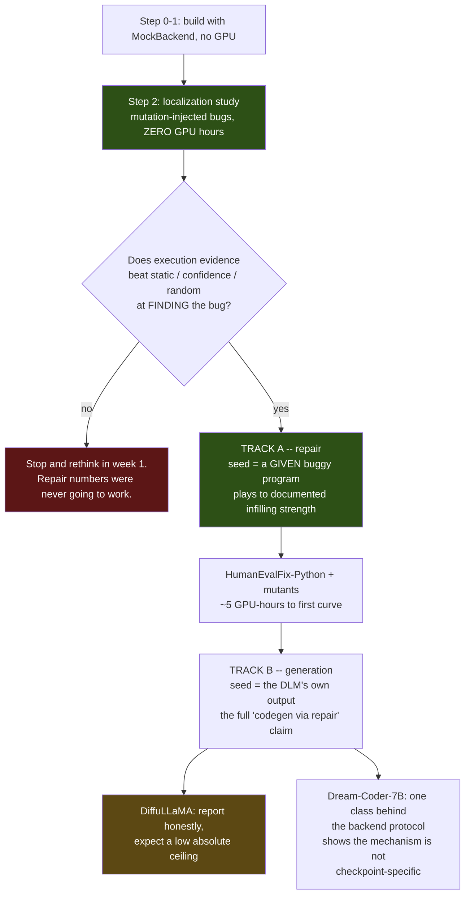

# Experiment plan

What we run, against what, compared to what, and what it costs. Read
[`01-architecture.md`](01-architecture.md) for how the code is shaped; this document is what the code is
for.

---

## 1. Research questions

| | Question | Answered by | Needs a GPU? |
|---|---|---|---|
| **RQ1** | Does execution evidence localize a fault better than static analysis, model confidence, or chance? | Step 2, mutation study | **No** |
| **RQ2** | Does recursive targeted repair convert failing programs into passing ones, and how does the yield decay with depth? | The repair curve | Yes |
| **RQ3** | Is a *dynamic* witness a better remasking anchor than a *static* one at matched budget? | `ours` vs `static` | Yes |
| **RQ4** | Does CDC's interior neighbourhood-scope optimum transfer from security bugs to functional bugs? | The scope ladder | Yes |

RQ3 is the paper's core claim. RQ4 is open question Q-8, described in the project's own notes as Option C's
single best remaining research question. **RQ1 is the one that de-risks everything**, and it costs nothing.

---

## 2. Two tracks

The single most consequential fact in this plan: **DiffuLLaMA has no reported whole-function code
generation ability.** Its paper reports only HumanEval *single-line infilling*, and that number belongs to a
separately trained `Diffu-CodeLLaMA` (see [`../README.md` §2](../README.md)). A plan that only measures
generate-then-repair is one weak checkpoint away from producing a flat line and no result.

So the work splits, and the low-risk half runs first.



**Track A is the POC. Track B is the paper.** Track A can produce a defensible result even if the backbone
turns out to be too weak to write functions from scratch, because it never asks it to.

---

## 3. Benchmarks

| Benchmark | n | Role | Notes |
|---|---|---|---|
| **HumanEvalFix** (Python, OctoPack) | 164 | Track A primary | Buggy solution + failing tests supplied. The repair benchmark CDC reports **zero** numbers on. |
| **Mutation-injected HumanEval+** | 200–500 mutants | RQ1 + Track A | We inject the bug, so ground-truth fault location is known **exactly**. Free, unlimited, no GPU. |
| **HumanEval+** (EvalPlus) | 164 | Track B primary | The most-cited code-generation benchmark, with EvalPlus's stronger tests. |
| **MBPP+** (EvalPlus) | 378 | Track B secondary | Statistical power — more than doubles n. |

**Counts are 164 + 378 = 542**, not the ~560 figure that predates EvalPlus v0.2.0
(`project-docs/03-established-facts.md` F-16).

⚠️ **EvalPlus stores test *inputs*, evaluated differentially against `canonical_solution` — not literal
assert strings.** The benchmark adapter must render them into runnable asserts itself. This is a documented
trap and a plausible source of a silently wrong harness.

### 3.1 Mutation operators

Single-statement, syntax-preserving-or-not, each with a known target line:

| Operator | Example | Yields |
|---|---|---|
| Comparison swap | `<` → `<=`, `==` → `!=` | assertion failure |
| Off-by-one | `range(n)` → `range(n-1)` | assertion failure |
| Operator swap | `+` → `-`, `and` → `or` | assertion failure |
| Boundary/init | `total = 0` → `total = 1` | assertion failure |
| Variable swap | `a` → `b` within scope | assertion or exception |
| Deletion | drop a statement | exception or assertion |
| **Token corruption** | delete a `)` or a `:` | **syntax error** |

The last one is deliberate: it exercises the **syntax gate** as a first-class evidence path, which the
requirement to cover "syntax checks as well as functional tests" demands. Syntax errors give the cleanest
localization signal we get (`SyntaxError.lineno`), and they will be common in Track B anyway.

### 3.2 The leakage guard — repair signal vs. reported metric

A repair loop that iterates against the tests it is scored on is fitting its own metric. Any reviewer will
say so immediately.

EvalPlus's `base_input` / `plus_input` split makes the fix clean:

> **The loop may only see the `base` tests. Reported pass@1 is computed on `base` + `plus`.**

So the extra EvalPlus tests are genuine held-out data, and the gap between "passes the tests it repaired
against" and "passes the held-out tests" is itself a reportable number — an overfitting rate. For
HumanEvalFix, which has no such split, we hold out a random third of the asserts and report both.

This is not optional bookkeeping. Without it, the headline number means nothing.

---

## 4. Baselines

All at **matched budget** — the same number of `generate_samples` calls and the same token mask budget per
call. Matched budget is fair here specifically because targeted remasking saves no compute:
`model.py:139` forwards the entire sequence every step regardless of how many positions are masked
(`project-docs/06-findings-and-wins.md` W-5), so "fewer masked tokens" buys nothing that needs discounting.

| # | Arm | Isolates, vs. `ours` |
|---|---|---|
| B0 | `none` — seed only, no repair | whether the loop does anything |
| B1 | `resample` — best-of-N full regeneration, N = depth cap + 1 | **repair vs. simply trying again** |
| B2 | `random` — random lines, matched token budget | informed vs. uninformed localization |
| B3 | `confidence` — lowest max-softmax positions, line-snapped | **structure vs. model self-assessment** |
| B4 | `static` — AST neighbourhood of a statically chosen node | **the dynamic anchor itself — RQ3** |
| — | `ours` — execution-grounded structural remask | — |

**B1 and B4 are the two that can kill the idea**, so they run from the first experiment rather than being
added later when the result is already known.

> **B3 must be built correctly or it is worthless.** `model.py:116` gathers the log-prob of the *sampled*
> token, not the maximum — sampling luck, not certainty — and `model.py:158` never returns it
> (`project-docs/03-established-facts.md` F-4). Building the confidence baseline on that would make it
> artificially weak and bias the comparison toward us. `backend.confidence()` computes **max softmax
> probability** from a fresh forward pass. This is recorded as mistake M-10 in the project's own notes;
> repeating it would be inexcusable.

---

## 5. Metrics

| Metric | Definition | Reported as |
|---|---|---|
| **pass@1 @ depth k** | fraction solved by depth *k*, k = 0…5 | the repair curve — the headline figure |
| **Δ pass@1** | pass@1(5) − pass@1(0) | per policy, per benchmark |
| **Localization top-1 / top-3** | is the ground-truth mutated line ranked 1st / top 3 | mutants only; **no GPU** |
| **Edit locality** | tokens changed ÷ tokens in program, vs. previous depth | tests the premise the whole idea rests on |
| **Regression rate** | repairs that fix ≥1 test and break ≥1 other | catches a loop that is degrading |
| **Overfitting gap** | pass@1(base) − pass@1(base+plus) | the leakage guard, §3.2 |
| **Steps-to-convergence** | denoising steps until the masked span stops changing | the *only* place an efficiency claim could live |
| **Outcome counts** | PASS / FAIL / ERROR / SYNTAX_ERROR / TIMEOUT / **HARNESS_ERROR** | always separated; harness errors never enter a numerator |

> ⛔ **No speed claims.** Repairing 5 tokens costs what regenerating 500 costs at equal step count. If
> steps-to-convergence turns out lower for targeted repair, that is an *unclaimed* opening nobody has
> measured — but it must be measured, not asserted.

---

## 6. Statistics

- **Paired by problem.** Every policy sees the same task list, same seeds, same budget.
- **McNemar's exact test** on the paired pass/fail vectors for each `ours` vs. baseline comparison.
- **Wilson score intervals** on every pass@1.
- **3 seeds** on the headline comparison only; ablations run at 1 seed and are labelled as such.
- **Honest power statement, written before we see results:** at n = 164, differences below roughly
  6–8 percentage points are unlikely to reach significance. That is why MBPP+ (n = 378) and pooled
  reporting are in the plan. We will report effect sizes and intervals, not just p-values, and we will not
  claim a win from a 3-point gap on 164 problems.

---

## 7. The grid

```
benchmark  ∈ {humanevalfix, mutants, humaneval_plus, mbpp_plus}
policy     ∈ {none, resample, random, confidence, static, ours}
backend    ∈ {diffullama, dream_coder, mock}
scope      ∈ {leaf, parent_leaf, function}          # ablation only
annotate   ∈ {none, comment}                        # ablation only
slack      ∈ {0, 4, 8}                              # ablation only
seed       ∈ {0, 1, 2}                              # headline only
max_depth  = 5
```

Ablations run on a fixed **50-problem subset** at 1 seed. The headline runs on the full benchmark.

---

## 8. Compute budget

**This is arithmetic, not measurement.** It is labelled as such deliberately: the project has one
documented instance of a FLOPs estimate being mistaken for a benchmark
(`project-docs/03-established-facts.md` F-17). One hour of wall-clock measurement on the real workstation
replaces this whole section, and that measurement is Phase 3's first task.

Cost of one `generate_samples` call ≈ `2 · N · L · T / (effective FLOPS)`, N = 6.74e9:

| L (canvas) | T (steps) | FLOPs | @ 44 TFLOP/s effective |
|---|---|---|---|
| 512 | 64 | 442 T | ~10 s |
| 512 | 32 | 221 T | ~5 s |
| 256 | 32 | 110 T | ~2.5 s |

Assumes bf16 on one RTX 6000 Pro Blackwell at roughly 35% MFU. **Plan around 1 × 96 GB, not 2** — the
workstation is shared between three team members and other users, and both cards being free at once is rare
(`project-docs/01-project-brief.md`).

> **Free speedup available first:** `inf_diffullama.py:24` defaults to `_attn_implementation="eager"`, and
> the inference attention mask is a dense 4-D all-zeros tensor — mathematically a no-op that nonetheless
> blocks flash attention (`project-docs/03-established-facts.md` F-7). Passing `None` with
> `flash_attention_2` should give a solid speedup for free. Do this before running the grid, not after.

Working at **L = 512, T = 32 (~5 s/call)**, with early exit on solved problems (assume ~55% of calls are
actually made):

| Run | Calls | GPU-hours |
|---|---|---|
| **Localization study (Step 2)** | 0 | **0** |
| Track A — HumanEvalFix, 5 policies, 1 seed | ~4,100 → ~2,250 | **~3** |
| Track A — 200 mutants, 5 policies, 1 seed | ~5,000 → ~2,750 | ~4 |
| Track B — HumanEval+, 5 policies, 1 seed | ~4,900 → ~2,700 | ~4 |
| Track B — MBPP+, 5 policies, 1 seed | ~11,300 → ~6,200 | ~9 |
| Ablations — 50-problem subset, 3 scopes × 2 annotate × 3 slack | ~6,700 → ~3,700 | ~5 |
| Headline × 3 seeds (HumanEvalFix + HumanEval+) | — | ~14 |
| Dream-Coder replication of the headline | — | ~7 |
| **Total** | | **~46 GPU-hours** |

Consistent with the project's own prior estimate of 30–80 GPU-hours. Two consequences worth stating:

1. **The first real result costs about three GPU-hours** — Track A, one seed, HumanEvalFix. That is an
   afternoon on one contended card, and it is the whole point of ordering the tracks this way.
2. **Checkpoint-and-resume is mandatory, not a nicety.** Runs are append-only JSONL keyed by
   `(run_id, task_id, depth)`, so a killed job resumes by skipping completed keys. On a contended shared
   workstation, any run that cannot survive being stopped will eventually be lost.

---

## 9. Threats to validity

Written now, so they are not discovered by a reviewer later.

| Threat | Mitigation, or honest limitation |
|---|---|
| **Backbone too weak for Track B** | Track A does not require generation ability; Dream-Coder replicates the headline. Reported honestly either way. |
| **Repairing against the evaluation tests** | §3.2 — the loop sees `base` only, scoring uses `base` + `plus`, and the gap is reported. |
| **Line-granular masking** | Chosen deliberately (`01-architecture.md` §5.2) and stated as a limitation: we cannot express a sub-line edit. |
| **Fixed-length infilling** | A hole of *n* tokens yields *n* tokens. Handled by the slack parameter and by rebuilding the canvas each depth; the slack sweep is reported, not hidden. |
| **Synthetic mutants ≠ real bugs** | Mutants are used for *localization ground truth*, not for the headline repair claim. HumanEvalFix carries that. |
| **Small n** | §6 — power stated up front; no wins claimed from small gaps. |
| **CDC comparison is not head-to-head** | CDC's code and CWEval setup differ. We implement a `static` policy in *our* harness as a faithful stand-in and say plainly that it is a re-implementation, not CDC's numbers. |
| **Preemption** | CDC was posted three months before this project found it. Re-run the novelty check at Step 4 and again before submission — the project's own decision principle #5. |

---

## 10. Ordering, and what each stage buys

| Stage | Output | GPU | Blocks what |
|---|---|---|---|
| Steps 0–1 | Working pipeline on `MockBackend` | none | everything |
| **Step 2** | **RQ1 answered — a real, reportable localization result** | **none** | go/no-go for the rest |
| Step 3 | Smoke test, and the wall-clock measurement that replaces §8 | ~1 h | the grid |
| Step 4 | The repair curve — RQ2, RQ3 | ~3 h | the paper |
| Step 5 | Track B, both backbones | ~25 h | the full claim |
| Step 6 | Ablations — RQ4 | ~5 h | the scope result |

The ordering is chosen so that **the first genuinely reportable result needs no GPU at all**, and the
second needs three hours. If the idea is wrong, we find out in week one for free.
