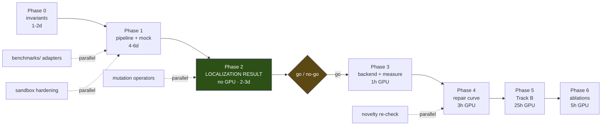

# Build phases

The order to write things in, and how to know each phase is actually done. Every phase ends in an
**acceptance test that can be run**, not a judgement call.

The ordering has one governing property: **the first reportable scientific result arrives before any GPU is
touched.** Everything up to and including Phase 2 runs on a laptop.

---

## Phase 0 — Hazards first, code second

> *Nothing else starts until this passes.*

| | |
|---|---|
| **Build** | `types.py`, `canvas.py`, and the invariant tests in [`03-hazards.md`](03-hazards.md) |
| **GPU** | none |
| **Depends on** | `transformers` only (~50 MB, no torch — `AutoTokenizer` needs neither torch nor a GPU) |
| **Effort** | 1–2 days |

**Why first.** The shift off-by-one is silent: it runs end to end and merely underperforms. The project has
produced this class of bug three times. `audit/test_shift_offset.py` and `audit/test_real_tokenizer.py`
already exist and already pass — Phase 0 is largely a matter of lifting their logic into `canvas.py` behind
a clean interface, not re-deriving it.

> ⚠️ **First action of Phase 0, before anything else.** `audit/test_real_tokenizer.py` is on `main`, but
> `audit/test_shift_offset.py` is **only on the `audit/opus-review` branch**, which decision D-2026-08-29-c
> schedules for deletion. Rescue it now:
> ```bash
> git show origin/audit/opus-review:audit/test_shift_offset.py > egr/tests/test_shift_offset.py
> ```

**Acceptance**
```bash
PYTHONIOENCODING=utf-8 pytest egr/tests/test_invariants.py egr/tests/test_canvas.py -q
```
- passes; **and**
- deleting the `+ 1` in `Canvas.canvas_positions()` makes `test_shift_invariant` fail (verify by hand once);
- `grep -rn '+ 1' egr/` shows exactly one index-arithmetic site.

---

## Phase 1 — The whole pipeline, without a model

| | |
|---|---|
| **Build** | `verify.py`, `trace.py`, `evidence.py`, `localize.py`, `policy.py`, `loop.py`, `report.py`, `cli.py`, `benchmarks/{base,mutants,humaneval_plus}.py`, and `MockBackend` |
| **GPU** | none |
| **Depends on** | Phase 0 |
| **Effort** | 4–6 days |

`MockBackend` is the key piece and deserves care. It satisfies `DiffusionBackend` exactly, on CPU,
deterministically, in three modes:

| Mode | Behaviour | Used for |
|---|---|---|
| `oracle` | fills the hole from the known-correct source | proving the loop closes at all |
| `noisy` | fills correctly with probability *p*, else emits a plausible wrong token | repair-curve shape without a GPU |
| `stuck` | always returns the same tokens | the no-progress detector (H-4) |

**Acceptance**
```bash
python -m egr.cli run --benchmark mutants --backend mock --mock-mode oracle \
                      --policy ours --max-depth 5 --out runs/smoke.jsonl
```
- ≥ 95% of oracle-mode mutants solved at depth ≥ 1;
- `stuck` mode aborts with `no_progress` and never exceeds 5 depths;
- `runs/smoke.jsonl` validates against the schema in [`01-architecture.md` §10](01-architecture.md);
- the sandbox tests in `test_verify.py` pass, including the runaway-loop and memory-bomb cases;
- `canonical_solution` passes and a known mutant fails, for **all 542** EvalPlus problems (H-10).

---

## Phase 2 — The localization study *(first real result — still no GPU)*

| | |
|---|---|
| **Build** | `benchmarks/mutants.py` mutation operators, the scoring harness, one figure |
| **GPU** | **none** |
| **Depends on** | Phase 1 |
| **Effort** | 2–3 days |

Inject single-statement mutations into HumanEval+ canonical solutions. Ground truth is known by
construction. Score `ours`, `static`, `confidence`, `random` on top-1 and top-3 statement accuracy, broken
down by evidence kind (syntax / assertion / exception / timeout).

> `confidence` needs `backend.confidence()`, which needs weights. On CPU, run it with **DiffuGPT-S (124M)**,
> which fits in 4 GB and runs on the smallest laptop in the team. It is the wrong model for repair quality
> but a perfectly valid one for a *localization* comparison, and it keeps Phase 2 GPU-free. State the
> substitution in the write-up.

**Acceptance**
```bash
python -m egr.cli localize --benchmark mutants --n 500 \
                           --policies ours,static,confidence,random --out runs/loc.jsonl
```
- a localization-accuracy table over ≥ 4 policies and ≥ 200 mutants, with Wilson intervals;
- per-evidence-kind breakdown;
- **the go/no-go decision is recorded** in `project-docs/02-decision-log.md`, whichever way it goes.

**This is the gate.** If execution-grounded evidence does not localize better than the alternatives, the
repair results were never going to work, and we have learned that in week one for zero GPU-hours. Say so in
the log and reconsider rather than pressing on.

---

## Phase 3 — Real backend, smoke test, and one hour of measurement

| | |
|---|---|
| **Build** | `backend.py::DiffuLLaMABackend`, the additive `confidence()` forward pass |
| **GPU** | ~1 hour |
| **Depends on** | Phase 2 passing its gate |
| **Effort** | 1–2 days |

Two jobs, in this order:

1. **Measure, then delete §8 of the experiment plan.** Time one `generate_samples` call at
   `L ∈ {256, 512}` × `T ∈ {32, 64}`, eager vs `flash_attention_2`. The compute budget is currently
   *arithmetic* and is labelled as such; one hour replaces it with fact. Apply the free speedup first —
   `inf_diffullama.py:24` defaults to eager, and the inference attention mask is a dense all-zeros 4-D
   tensor that blocks flash attention while being mathematically a no-op
   (`project-docs/03-established-facts.md` F-7).
2. **Smoke-test 10 problems** end to end.

**Acceptance**
- measured seconds-per-call recorded in `project-docs/03-established-facts.md`, replacing the estimate;
- ≥ 1 problem that fails at depth 0 passes at depth ≤ 5;
- **the diff between depths is confined to the masked span** — assert this, do not eyeball it. If tokens
  outside the mask changed, `src_mask` is wrong and every subsequent number is meaningless.

---

## Phase 4 — The repair curve (Track A)

| | |
|---|---|
| **Run** | HumanEvalFix-Python + 200 mutants × 6 policies × 1 seed, then 3 seeds on the headline |
| **GPU** | ~3 h for the first curve, ~14 h for 3 seeds |
| **Depends on** | Phase 3 |
| **Effort** | 2 days, mostly waiting |

**Acceptance**
- the repair-curve figure: pass@1 vs depth 0…5, one line per policy, Wilson intervals;
- McNemar's exact test for `ours` vs each of `resample`, `static`, `confidence`, `random`;
- the **overfitting gap** reported alongside (H-7);
- HARNESS_ERROR count reported as its own row, and it should be ~0.

Also at Phase 4: **re-run the novelty check** (H-14). CDC was found three months after posting; the project
principle is to re-check at every milestone.

---

## Phase 5 — Track B, both backbones

| | |
|---|---|
| **Run** | HumanEval+ and MBPP+, seed generated by the DLM itself; DiffuLLaMA and Dream-Coder-v0-Instruct-7B |
| **GPU** | ~25 h |
| **Depends on** | Phase 4 |
| **Effort** | 3–4 days, mostly waiting |

Dream needs its own explicit decoding configuration — it ships `alg: "origin"` (random order) and
`temperature: 0.0`, and running it without setting `alg="entropy"` silently benchmarks random-order
decoding (H-4, F-10).

**Acceptance**
- the same curve for both backbones;
- the DiffuLLaMA result reported honestly whatever it is, including a flat line;
- edit-locality numbers for `ours` vs `resample` — this is where the premise in the README's first
  paragraph is actually tested.

---

## Phase 6 — Ablations and write-up

| | |
|---|---|
| **Run** | scope ladder (RQ4), annotation channel, slack sweep, steps-to-convergence |
| **GPU** | ~5 h |
| **Depends on** | Phase 5 |

The scope ladder is the one with independent research value: CDC's interior optimum (Parent+Leaf 34.3 >
use-def slice 26.9 > token window 24.1) is measured on **CWEval, a security benchmark**, and whether it
transfers to functional bugs is unmeasured (Q-8, F-9, W-4).

**Acceptance**
- scope ablation table with the interior-optimum question answered either way;
- annotation ablation — and if the natural-language channel does not help a base model, that is a finding,
  reported as one;
- slack sweep, which quantifies how much room a targeted repair actually needs (H-3).

---

## Critical path, and where the parallelism is



**Roughly two weeks to the first repair curve**, of which only ~4 GPU-hours are on the critical path.

---

## Work split against the team's actual constraints

Only three of seven members have workstation access, and the GPUs are contended
(`project-docs/01-project-brief.md`). The phase ordering is built around that rather than in spite of it.

| Work | Needs | Who |
|---|---|---|
| Phases 0–2 in full — invariants, canvas, verifier, sandbox, tracer, localizer, policies, loop, benchmark adapters, mutation operators, **the entire first result** | CPU, `transformers` (~50 MB) | anyone, including the four without GPU access |
| DiffuGPT-S confidence runs for Phase 2 | 4 GB VRAM or CPU | any laptop |
| Phases 3–6 | the Blackwell workstation | Aaditya, Aryan, Arjun |
| Analysis, figures, write-up | CPU | anyone |

Two operational requirements that follow from contention, both already flagged in the project brief:

- **A GPU claiming convention** — a pinned note saying who holds which card and until when. Two people
  launching at once will OOM each other.
- **Checkpoint-and-resume is mandatory.** Runs are append-only JSONL keyed by `(run_id, task_id, depth)`;
  a killed job resumes by skipping completed keys. Any run that cannot survive being stopped will
  eventually be lost.

---

## Definition of done for the POC

The proof of concept is complete when all five hold:

1. `pytest egr/tests/ -q` passes, including every hazard test in [`03-hazards.md`](03-hazards.md).
2. The localization study (Phase 2) has produced a table, with a recorded go/no-go decision.
3. A repair curve exists for Track A on HumanEvalFix, over ≥ 4 policies at matched budget.
4. `ours` vs `static` and `ours` vs `resample` are reported with McNemar tests and effect sizes — **whatever
   the direction of the result.**
5. Every number in the write-up traces to a JSONL record that can be regenerated from a single CLI command.

Point 4 is the one worth restating: the plan is designed so that a negative result is still a result. If
dynamic anchoring does not beat static anchoring, that is a genuine finding about a mechanism nobody has
tested, and the harness that established it is itself a contribution — CDC reports no repair-benchmark
numbers and no confidence baseline at all.
