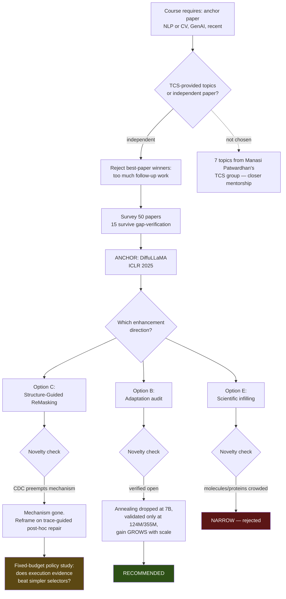
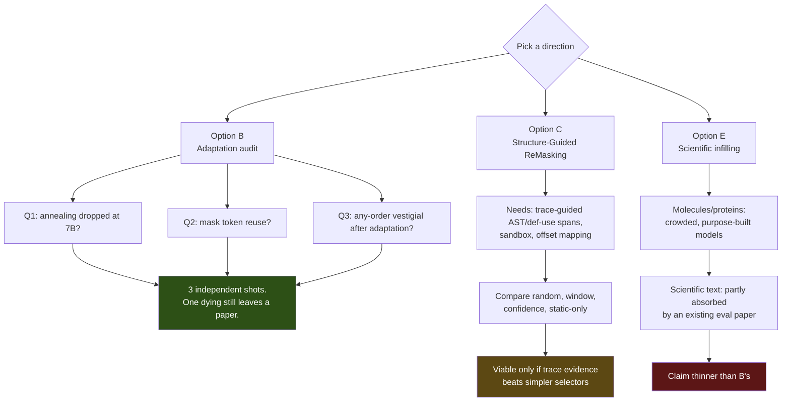
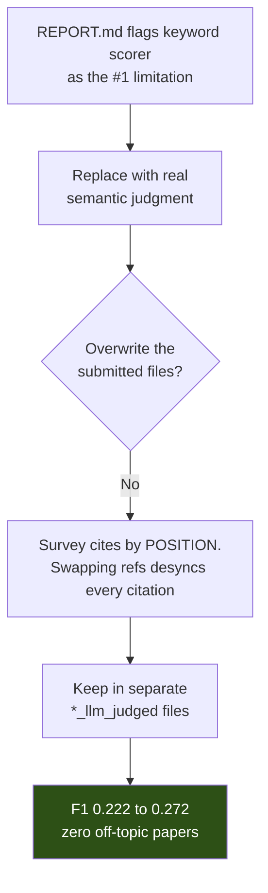
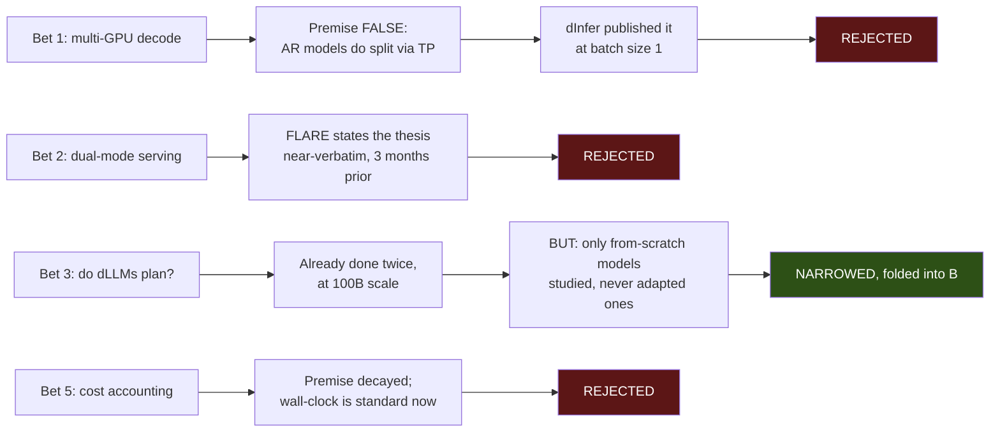
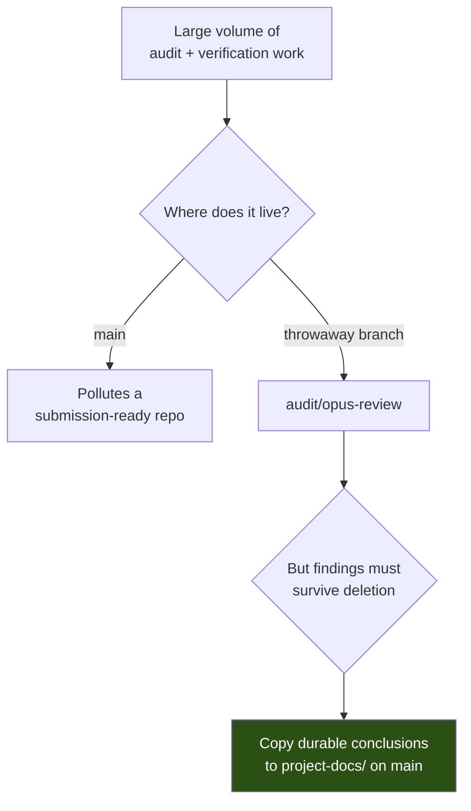

# Decision tree — how we got here

The reasoning chain behind every major fork, so nobody re-walks a path that was already closed.
Diagrams render natively on GitHub.

---

## The whole project, top to bottom

---

## Fork 1 — anchor paper selection

**Question:** independent paper, or one of TTV's seven pre-defined topics?

| Path | Reasoning | Outcome |
|---|---|---|
| TTV's seven topics | All traceable to Manasi Patwardhan's TCS group — one cites her DBRouting paper by name, two mirror her own 2024-25 papers. Likely closer mentorship, possible data access. | **Not chosen** |
| Independent paper | Freedom to pick on technical merit. | **Chosen** → DiffuLLaMA |

**Sub-decision: exclude best-paper-award winners.** Flagship award winners attract the heaviest follow-up
work, so an open gap is unlikely. A 50-paper survey produced 15 gap-verified survivors and 35 rejects, each
reject naming the paper that closed its gap.

> **If revisiting:** the TCS path is still available and would satisfy the course equally. The tradeoff was
> mentorship vs independence, not quality.

---

## Fork 2 — the direction decision (⏳ still open)

### Why B is recommended

| Criterion | B | C |
|---|---|---|
| Course fit | **Exact** — *is* reproduce-then-interrogate the anchor | Tangential to the anchor |
| Novelty grounding | A **quotable inconsistency** in the anchor's own text | Follow-up to a preprint |
| Engineering risk | Low — training runs and evaluation | **Very high** — CPG, tracing, sandbox, offset mapping |
| Silent-failure surface | Minimal | **Two known** (off-by-one, `alg="origin"`) |
| Result value | **Interesting either way** | Weak if confirmatory |
| Failure tolerance | **3 independent shots** | 1 claim, already dented |
| Preemption risk | Low, cheap to re-check | **Already realised** (CDC) |

### Why C is not dead, just harder

The execution-grounded seeding gap is **verified genuinely open** — no paper anywhere seeds a structural
remask from a failing test or traceback. And CDC has no confidence baseline at matched budget, so that
comparison exists nowhere.

The honest framing if refined C2 is chosen:

> *"CDC established static-analysis-witness-guided remasking, while CDLM studies confidence-guided revision
> after correction-oriented post-training. We ask whether actual failing-test traces improve fixed-budget,
> post-hoc repair location selection for a frozen diffusion code model."*

Defensible. Visibly a follow-up. Should be written as one.

---

## Fork 3 — how the litreview extension was scoped

**The judgement call:** improving a deliverable is worthless if it silently breaks it. The generated survey
references `[1]`–`[48]` by position against the original `reference_brief.txt`; substituting a better
reference set would leave every citation marker pointing at the wrong paper. Additive, not destructive.

---

## Fork 4 — rejected directions, and why

**Note on bet 1:** the hardware objection was **partially retracted** once 2× RTX 6000 Pro Blackwell plus
Sharanga access was confirmed — the experiment is runnable. The rejection stands on the false premise and
on dInfer/Sangam having published the core claim. Two GPUs still cannot support a scaling argument, which
is the actual contribution claimed.

---

## The meta-decision: keep audit work on a throwaway branch

This is why `project-docs/` exists on `main` and `audit/` does not.

---

## Decision principles this project has converged on

1. **Verify against the primary source when a claim is load-bearing.** Five separate errors traced to
   trusting a summary — see `05-mistakes-and-bugs.md` §A.
2. **Record retractions rather than editing them away.** The bet-1 hardware objection and the Fig. 8(b)
   framing were both corrected in place, with the correction visible.
3. **Label unverified claims as unverified.** Where a search did not complete, that is stated rather than
   presented as coverage.
4. **Additive over destructive.** Improvements go in new files when existing deliverables depend on the
   old ones.
5. **Re-check novelty at every milestone, not once.** CDC was posted three months before it was found and
   nearly invalidated a semester's framing.
